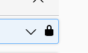
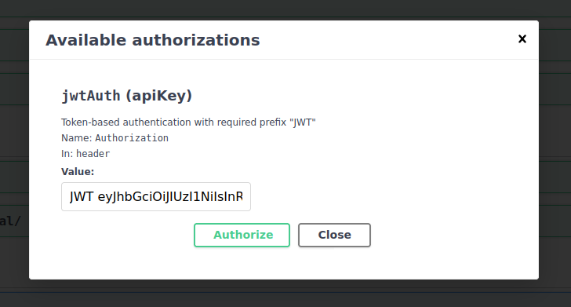

# Project Name

Api-gateway

This is main service, which accepts all request and then this request send into another service, if you want to test
full route of requests you should launch this service, and then another

## Getting Started

Follow these steps to successfully run the project using `docker-compose`.

### Install Docker and Docker Compose

Before you begin, make sure you have Docker and Docker Compose installed on your system.

### Running the Services locally

1. Open a terminal and navigate to the root directory of the project.

2. Run the following command to start the services. docker-compose and docker-compose-local it is for local
environment, other compose files for deploying:

   ```bash
   docker-compose up
   ```
   ```bash
   docker-compose -f docker-compose-local up
   ```
   
### Commands
All commands which we want to use in our project we should use inside container, see makefile

Example:
   ```bash
   docker exec -it api-gateway pytest -v -s
   ```
 

## Local Links
1. Links for linux:
       http://0.0.0.0:8000/docs
       http://0.0.0.0:8000/admin 
       http://0.0.0.0:5555 
2. Links for Windows:
       http://127.0.0.1:8000/docs
       http://127.0.0.1:8000/admin 
       http://127.0.0.1:5555 

	api-gateway:
       http://0.0.0.0:8000/docs
       http://0.0.0.0:8000/admin  - admin
       http://0.0.0.0:5555  - flower

## Links for deployed applications
1. IP of deployed applications(id you want to use swagger, add "/docs" to this routs, like http://10.10.14.3:8000/docs)

	api-gateway:
		http://10.10.14.3:8000 - dev
		http://10.10.14.9:8000 - test
		http://10.10.14.24:8000 - prod
	
	cards:
		http://10.10.14.3:8002 - dev
		http://10.10.14.9:8002 - test
		http://10.10.14.24:8002 - prod
	
	accounts:
		http://10.10.14.3:8003 - dev
		http://10.10.14.9:8003 - test
		http://10.10.14.24:8003 - prod

   
## Registration(4 steps)
This 3 first steps you should send data to this url /api/auth/registration/
1. In first step you should send first name, last name, passport id, birth date:

       {
       "first_name": "Ivan",
       "last_name": "Ivanov",
       "passport_id": "QWERTY1233",
       "birth_date": "2200-10-01"
       }  
   
2. In second step you should add to previous data phone number and email and server send otp code to your email:
   		
       {
       "first_name": "Ivan",
       "last_name": "Ivanov",
       "passport_id": "QWERTY1233",
       "birth_date": "2200-10-01",
       "email": "ivanov@gmail.com",
       "phone_number": "+377287777777"
       }
   
3. In third step you should add to previous data otp code which you got in your email:
         
       {
       "first_name": "Ivan",
       "last_name": "Ivanov",
       "passport_id": "QWERTY1233",
       "birth_date": "2200-10-01",
       "email": "ivanov@gmail.com",
       "phone_number": "+377287777777",
       "otp_code": "123456"
       }
   
4. But fourth step(last step), you should send all data with password, but without otp_code to this url
/api/auth/registration/final/:
         
       {
       "first_name": "Ivan",
       "last_name": "Ivanov",
       "passport_id": "QWERTY123",
       "birth_date": "2200-10-01",
       "email": "ivanov@gmail.com",
       "phone_number": "+377287777777",
       "password": "Qwert123@",
       "password2": "Qwert123@"
       }


## Authorization by JWT token
1. Send json with you credentials:
     
       {
       "email": "root@mail.ru",
       "password": "1234"
       }
2. and after you will get access and refresh token, copy access token and paste like in the pictures:

    1. Click to this lock in swagger on the right side of endpoint

    2. then add JWT and access token, like in the picture



